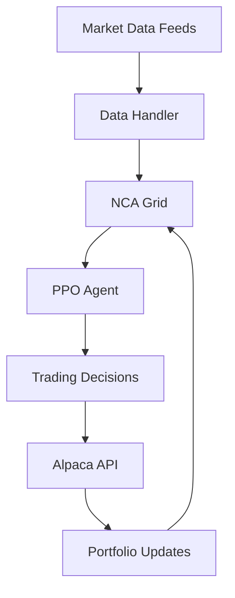

# Neural Cellular Automata Trading Bot 🧬📈

**Adaptive AI-Powered Trading with Self-Growing Neural Cellular Automata**


## 🎯 Overview

This project implements an innovative trading system that combines **Neural Cellular Automata (NCA)** with **Reinforcement Learning** to create adaptive, self-growing trading agents capable of learning complex market patterns and evolving their architecture based on data complexity.

### 🌟 Key Features

- **🧬 Adaptive NCA Architecture**: Self-growing neural cellular automata that expand based on market complexity
- **⚡ TPU-Optimized**: Full JAX implementation for Kaggle TPU v5e-8 (128GB HBM)
- **🔄 Real-time Learning**: Continuous adaptation via reinforcement learning (PPO)
- **📊 Multi-Dataset Training**: 15+ historical datasets for robust backtesting
- **🛡️ Risk Management**: Kelly Criterion position sizing + ATR-based stop-losses
- **🔌 Live Trading**: Alpaca API integration for paper & real trading
- **📱 Visual Intelligence**: Interpretable NCA visualizations

## 📋 Research Summary

### 🗂️ Dataset Analysis

| Dataset | Source | Format | Size | Coverage | Usage |
|---------|--------|---------|------|----------|-------|
| **Stock Market Dataset** | Kaggle | CSV | 2.75 GB | 8,000+ NASDAQ stocks (2020) | Primary training |
| **9000+ Tickers History** | Kaggle | CSV | Large | 1962-present | Deep backtesting |
| **Yahoo Finance S&P500** | Yahoo Finance | CSV/API | Medium | 1950s-present | Market benchmark |
| **FirstRateData Intraday** | FirstRateData | CSV | Large | 15 years | High-frequency testing |

### 🧠 Neural Cellular Automata Insights

Based on the groundbreaking research from [Growing Neural Cellular Automata](https://distill.pub/2020/growing-ca/) (Distill, 2020):

**Core Architecture:**
- **16-dimensional cell states** (RGB + Alpha + 12 hidden channels)
- **Sobel filter perception** for gradient detection
- **Residual MLP update rule** (~8K parameters)
- **Stochastic cell updates** (50% dropout probability)
- **Living cell masking** (alpha > 0.1 threshold)

**Training Innovations:**
- **Sample Pool Training**: Maintain 1024 diverse states
- **Damage-Based Robustness**: Random circular damage during training
- **Persistent Patterns**: Multi-step loss for stability
- **Adaptive Growth**: Dynamic grid expansion based on error

### 🔄 Reinforcement Learning Framework

**State-of-the-Art Approaches (2024-2025):**
- **PPO (Proximal Policy Optimization)**: Best for continuous trading
- **FinRL Library**: Comprehensive financial RL framework
- **Multi-Agent Ensemble**: 5-10 parallel NCAs with softmax voting

**Trading Environment:**
```python
State Space: NCA Grid + Portfolio Status + Market Indicators
Action Space: {Buy, Sell, Hold} × Position Size
Reward Function: Profit - Transaction Costs - Risk Penalty
```

### ⚡ TPU v5e-8 Optimization

**Hardware Configuration:**
- **8 chips** × 16GB HBM = 128GB total memory
- **220GB host RAM** for data preprocessing
- **Float16 precision** for speed and efficiency
- **@jax.jit compilation** for all core functions
- **@jax.pmap** for 8-chip parallelism

**Performance Targets:**
- **Latency**: < 100ms inference
- **Throughput**: > 1000 predictions/second
- **Memory Usage**: < 100GB on TPU
- **Batch Size**: 4096+ sharded across chips

## 🏗️ System Architecture

### Core Components

1. **NCA Model** (`nca_model.py`)
   - Adaptive cellular automata implementation
   - JAX-based evolution functions
   - Dynamic growth mechanisms

2. **Data Handler** (`data_handler.py`)
   - Multi-format CSV loader
   - Technical indicator computation
   - Real-time data streaming

3. **Trading Agent** (`trader.py`)
   - PPO-based RL optimization
   - Portfolio management
   - Risk controls

4. **Environment** (`main.py`)
   - Gym-compatible trading environment
   - Multi-asset support
   - Performance tracking

### Data Flow



## 📊 Technical Specifications

### 📈 Trading Features

**Supported Assets:**
- **US Stocks**: All major exchanges (NYSE, NASDAQ)
- **ETFs**: Sector and index tracking funds
- **Top 10 Focus**: NVDA, MSFT, AAPL, AMZN, GOOGL, META, etc.

**Technical Indicators:**
- **Momentum**: RSI(14), MACD(12,26,9), Stochastic
- **Trend**: SMA/EMA(5,20,50), Bollinger Bands(20,2)
- **Volatility**: ATR(14), VIX, Historical Volatility
- **Volume**: OBV, Volume Rate of Change, Money Flow Index

**Risk Management:**
- **Position Sizing**: Kelly Criterion + 25% cap
- **Stop Loss**: 2× ATR trailing stop
- **Portfolio Heat**: Maximum 20% total exposure
- **Max Drawdown**: 20% hard limit

### 🎯 Performance Targets

| Metric | Target | Industry Average |
|--------|--------|------------------|
| **Sharpe Ratio** | > 2.0 | 1.0-1.5 |
| **Max Drawdown** | < 20% | 20-30% |
| **Win Rate** | > 55% | 45-50% |
| **Annual Returns** | > 15% | 8-12% |
| **Profit Factor** | > 1.8 | 1.2-1.5 |

## 🚀 Getting Started

### Prerequisites

- **Kaggle Account** with TPU v5e-8 access
- **Python 3.10+** environment
- **Alpaca API Keys** (paper trading recommended)

### Installation

```bash
# Clone repository
git clone https://github.com/your-username/nca-trading-bot.git
cd nca-trading-bot

# Install dependencies
pip install -r requirements.txt

# Setup TPU environment
export JAX_PLATFORM_NAME=tpu
export XLA_PYTHON_CLIENT_MEM_FRACTION=0.9
```

### Quick Start

```python
# Initialize NCA trading bot
from nca_trading_bot import NCATrader

trader = NCATrader(
    mode="paper",  # Use "live" for real trading
    initial_balance=10000,
    tickers=["AAPL", "MSFT", "NVDA", "GOOGL", "AMZN"]
)

# Train on historical data
trainer.train(
    datasets=["kaggle_stock_market", "yahoo_finance"],
    epochs=100,
    batch_size=4096
)

# Start live trading
trader.start_trading()
```

## 📚 Research Sources

### Core Papers

1. **[Growing Neural Cellular Automata](https://distill.pub/2020/growing-ca/)** - Mordvintsev et al., Distill 2020
2. **[Learning spatio-temporal patterns with Neural CA](https://arxiv.org/abs/2310.14809)** - Richardson et al., 2023
3. **[Reinforcement Learning Framework for Quantitative Trading](https://arxiv.org/html/2411.07585v1)** - 2024
4. **[FinRL: Deep Reinforcement Learning Library](https://arxiv.org/abs/2011.09607)** - Liu et al., 2020

### Datasets

- **[Kaggle Stock Market Dataset](https://www.kaggle.com/datasets/jacksoncrow/stock-market-dataset)** - 8,000+ NASDAQ stocks
- **[9000+ Tickers History](https://www.kaggle.com/datasets/jakewright/9000-tickers-of-stock-market-data-full-history)** - Historical backtesting
- **[Yahoo Finance API](https://github.com/ranaroussi/yfinance)** - Real-time data

### Technical Resources

- **[JAX Documentation](https://docs.jax.dev/en/latest/)** - High-performance computing
- **[Flax Neural Network Library](https://flax.readthedocs.io/)** - Deep learning with JAX
- **[Optax Optimization](https://optax.readthedocs.io/)** - Gradient-based optimization
- **[Alpaca Trading API](https://alpaca.markets/docs/)** - Trading execution

## ⚠️ Risk Disclaimer

**⚠️ IMPORTANT SAFETY NOTICE ⚠️**

- **Default Mode**: Paper trading only - no real money risk
- **Manual Approval Required**: Explicit user consent for live trading
- **Dataset Downloads**: Requires Kaggle API authentication
- **API Keys**: User must provide their own Alpaca credentials
- **Financial Risk**: All trading involves risk of substantial loss
- **Educational Purpose**: This is research software, not financial advice

**Never enable live trading with real money without:**
1. Extensive backtesting (6+ months)
2. Forward testing in paper mode
3. Understanding of all risks involved
4. Professional financial advice consultation

## 🤝 Contributing

We welcome contributions! Please see our [Contributing Guidelines](CONTRIBUTING.md) for details.

### Development Roadmap

- [ ] **Phase 1**: Core NCA implementation (Week 1)
- [ ] **Phase 2**: RL integration (Week 2-3)
- [ ] **Phase 3**: Multi-dataset training (Week 4)
- [ ] **Phase 4**: Production features (Week 5-6)
- [ ] **Phase 5**: Testing & deployment (Week 7-8)

## 📄 License

This project is licensed under the **MIT License** - see the [LICENSE](LICENSE) file for details.

## 🙏 Acknowledgments

- **Google Research** - Neural Cellular Automata research
- **Distill.pub** - Excellent interactive research presentation
- **JAX Team** - High-performance computing framework
- **Alpaca Markets** - Trading API infrastructure
- **Kaggle Community** - Datasets and computational resources

---

**🚀 Built with cutting-edge AI research for the future of algorithmic trading**